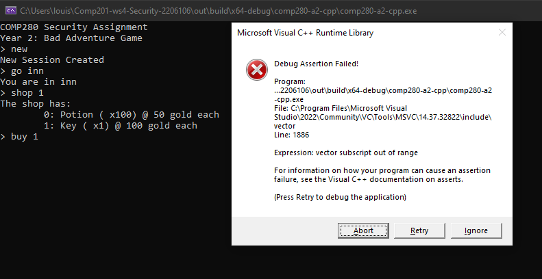

# COMP201 Security Assignment  
  
## Table of Contents
[Things to Note](#Introduction)  

[1 - Administrators Teleport Command can be used by Unauthorized players](#Issue1)  
[2 - Administration Password is Hardcoded](#Issue2)  
[3 - Administration Password can be Bruteforced](#Issue3)  
[4 - Crashes due to Invalid Arguments](#Issue4)  
[5 - Player can use 0 Potions](#Issue5)  
[6 - Player Item Inventory Loops to 0 when it reaches over 255](#Issue6)  
[7 - Selling a Negative Amount of Items Buys the Items Instead](#Issue7)  
[8 - Displaying Administrator Commands to Unauthorized Users](#Issue8)  
[9 - Displaying Unusable Commands to Guests](#Issue9)  
[10 - The Game Loops Commands due to Invalid Arguments](#Issue10)  
[11 - The World State cannot be Saved and Loaded.](#Issue11)  
[12 - Player is able to use Multiple Keys at the Gate](#Issue12)  
[13 - The Shop does not Restock Items You Sell to It](#Issue13)   
  

<a id="Introduction"></a>
# Things to Note.
Below I documented all the Issues I found. To identify the type of issue I have used CWE, which stands for Common Weakness Enumeration [[1]](#Ref1). This is a "community-developed list" of the most known issues.  

I used Common Weakness Scoring System (CWSS) for calculating and justifying the severity. I used a calculator [[2]](#Ref2) to calculate the scores, you can see what I inputted into the calculator by using the CWSS Link (All links work as of 07/12/2023).  

For identifying and justifying the CIA triad I referred to the definitions laid out in “The Cia Strikes Back: Redefining Confidentiality, Integrity and Availability in Security” [[3]](#Ref3).  

<a id="Issue1"></a>
## Issue 1 - Administrators teleport command can be used by unauthorized players.
Unauthorized users can use the admTp command, this allows the players to teleport anywhere they want within the game, completing the game instantly.
* **Problem Type**: Improper Authorization [[4]](#Ref4)    
* **Severity**: Medium – Gives a massive advantage to players. 
* **CWSS Score**: 40.3
* **CWSS Link**: https://www.cwss-score.info/#TI:M,0.6/AP:A,1/AL:D,0.9/IC:L,0.9/FC:T,1/RP:RU,0.7/RL:A,1/AV:L,0.5/AS:N,1/IN:NA,1/SC:A,1/BI:L,0.3/DI:H,1/EX:H,1/EC:N,1/P:NA,1/  
### Impact
Allows the player to teleport anywhere in the game, resulting in the player instantly completing the game.
* **Confidentiality**: N/A
* **Integrity**: Grants unauthorized users to have access to a command/resource they should not have.
* **Availability**: N/A   

In the context of a multiplayer framework this could potentially be more problematic, especially if players can teleport other players.
### Proof of concept
```
Year 2: Bad Adventure Game
> new
New Session Created
> admTp castle
You teleport to castle
> links
You are in castle
gate, dungeon
> go dungeon
You are in dungeon
A winner is you!
	Look, I have no idea why going to the dungeon makes you win either.
	I'm a programmer, not a designer...
```
### Suggested Fix
Perform a check to see if the player is an administrator before teleporting the player.   
#### world.cpp -> admTeleport()  
```c++
if (!is_active(state) || state.m_level != UserLevel::ADMIN) {
	out << "You need to be Admin to do that..." << std::endl;
	return;
}
```
<a name="Issue2"></a>
## Issue 2 - Administration password is hardcoded.
The administrator password is hardcoded, meaning it is visible within the code.
* **Problem Type**: Exposure of Sensitive Information to an Unauthorized Actor. [[5]](#Ref6)  
* **Severity**: High - Grants unauthorised users administrator access.  
* **CWSS Score**: 71.0 
* **CWSS Link**: https://www.cwss-score.info/#TI:H,0.9/AP:A,1/AL:A,1/IC:N,1/FC:T,1/RP:RU,0.7/RL:A,1/AV:L,0.5/AS:N,1/IN:NA,1/SC:A,1/BI:C,1/DI:L,0.2/EX:H,1/EC:N,1/P:NA,1/    
### Impact
Allows unauthorised users to access and use all the administrator commands.
* **Confidentiality**: Possibility to access sensitive data.
* **Integrity**: Grants unauthorized users access commands they should not have access to.
* **Availability**: Administrator access might allow shutdown of the server.  

In a multiplayer framework can have a much greater impact if administrator commands have power over other players and their data.   
### Proof Of Concept
```C++
if (password != "MagicPassword42") {
	AdminTries -= 1;
	out << "Incorrect password" << std::endl;
	return;
}
```
### Possible Fix
Suggest Encrypting the password. Even storing the password in a database or server so unauthorized people can not get access to it, storing it in a database will also allow it to be changed much easier if need be for example if the password gets leaked.  
#### main.cpp -> promote()
```c++
std::hash<std::string> Hashing;
if (Hashing(password) != 5029200682126204187) {
	AdminTries -= 1;
	out << "Incorrect password" << std::endl;
	return;
}
```
You can make it more secure by salting and peppering the hash. salting is the example below.
```c++
std::hash<std::string> Hashing;
std::string salt = "gjsbijfnasljfkbeaf";
if (Hashing(password + salt) != 13372464928578503471) {
	AdminTries -= 1;
	out << "Incorrect password" << std::endl;
	return;
}
```

<a name="Issue3"></a>
## Issue 3 - Administration password can be bruteforced. 
The password can be attempted repeatedly until users find the password.
* **Problem Type** : Improper Restriction of Excessive Authentication Attempts. [[6]](#Ref6)  
* **Severity** : Medium – It takes time to do this and is completely chance based.
*  **CWSS Score**: 64.7  
* **CWSS Link**: https://www.cwss-score.info/#TI:H,0.9/AP:A,1/AL:A,1/IC:N,1/FC:T,1/RP:RU,0.7/RL:A,1/AV:L,0.5/AS:N,1/IN:NA,1/SC:A,1/BI:C,1/DI:H,1/EX:Q,0.01/EC:N,1/P:NA,1/   

### Impact
Users can promote themselves to an administrator if they guess/find the password.
* **Confidentiality**: Possibility to access sensitive data.
* **Integrity**: Allows the user to access commands they shouldn't be able to.
* **Availability**: Administrator access might allow shutdown of the server.  

Likelihood of this happening is low but there still is a chance. With computers becoming more powerful overtime the time it takes to bruteforce shortens.  

### proof of concept
```
COMP280 Security Assignment
Year 2: Bad Adventure Game
> new
New Session Created
> promote MagicPassword40
Incorrect password
> promote MagicPassword41
Incorrect password
> promote MagicPassword42
You are now admin.
>
```
### Suggested Fix
Add a certain amount of tries/Attempts e.g. 3 before stopping user from being allowed to guess.  
#### main.cpp -> promote()
```C++
if (AdminTries <= 0) {
	out << "You have entered too many Inccorect passwords please wait:" << std::endl;
	return;
}
if (password != "MagicPassword42") {
	AdminTries -= 1;
	out << "Incorrect password" << std::endl;
	return;
}
```
<a name="Issue4"></a>
## Issue 4 - Crashes due to Invalid Arguments. 
When you use a command but give it an incorrect number of arguments it crashes the game.
* **Problem Type**: Improper Input Validation. [[7]](#Ref7)  
* **Severity**: Medium – Closes the player game could much more severe if it crashed the server/network.   
*  **CWSS Score**: 68.6  
* **CWSS Link**: https://www.cwss-score.info/#TI:C,1/AP:N,0.1/AL:NA,1/IC:N,1/FC:T,1/RP:N,1/RL:D,0.9/AV:L,0.5/AS:N,1/IN:NA,1/SC:A,1/BI:H,0.9/DI:H,1/EX:H,1/EC:N,1/P:W,1/  
### Impact
Will crash the players game unexpectedly losing the players unsaved progress. 
* **Confidentiality**: N/A
* **Integrity**: Can cause data to corrupt.
* **Availability**: Stop player from playing.  
   
In a multiplayer framework could be much more servere if it crashes the server.  
### Proof of concept

### Suggested Fix
Add checks to see if the argument requirement is met (There has to be a more efficent way since you would have to add this check everywhere).
```c++
	if (input.args.size() != 2) {
		out << "invalid number of arguments" << std::endl;
		return;
	}
```
Below is all the places where these checks should be put (As this is where they all will occur). 
```
Confirmed reference	int itemAsInt = std::stoi( input.args[0] );	Comp201-ws4-Security-2206106\comp280-a2-cpp\cli\shop.cpp	44	38	comp280-a2-cpp.exe (comp280-a2-cpp\comp280-a2-cpp.exe) - x64 Debug					Read
Confirmed reference	int amountToBuy = std::stoi( input.args[1] );	Comp201-ws4-Security-2206106\comp280-a2-cpp\cli\shop.cpp	46	37	comp280-a2-cpp.exe (comp280-a2-cpp\comp280-a2-cpp.exe) - x64 Debug					Read
Confirmed reference	Item itemToSell = (Item)( std::stoi( input.args[0] ) );	Comp201-ws4-Security-2206106\comp280-a2-cpp\cli\shop.cpp	81	45	comp280-a2-cpp.exe (comp280-a2-cpp\comp280-a2-cpp.exe) - x64 Debug					Read
Confirmed reference	int amountToSell = std::stoi( input.args[1] );	Comp201-ws4-Security-2206106\comp280-a2-cpp\cli\shop.cpp	82	38	comp280-a2-cpp.exe (comp280-a2-cpp\comp280-a2-cpp.exe) - x64 Debug					Read
Confirmed reference	Item item = (Item)std::stoi( input.args[0] );	Comp201-ws4-Security-2206106\comp280-a2-cpp\cli\shop.cpp	105	37	comp280-a2-cpp.exe (comp280-a2-cpp\comp280-a2-cpp.exe) - x64 Debug					Read
Confirmed reference	int amount = std::stoi( input.args[1] );	Comp201-ws4-Security-2206106\comp280-a2-cpp\cli\shop.cpp	106	32	comp280-a2-cpp.exe (comp280-a2-cpp\comp280-a2-cpp.exe) - x64 Debug					Read
Confirmed reference	Item item = (Item)std::stoi( input.args[0] );	Comp201-ws4-Security-2206106\comp280-a2-cpp\cli\shop.cpp	118	37	comp280-a2-cpp.exe (comp280-a2-cpp\comp280-a2-cpp.exe) - x64 Debug					Read
Confirmed reference	int price = std::stoi( input.args[1] );	Comp201-ws4-Security-2206106\comp280-a2-cpp\cli\shop.cpp	119	31	comp280-a2-cpp.exe (comp280-a2-cpp\comp280-a2-cpp.exe) - x64 Debug					Read
Confirmed reference	auto target = input.args[0];	Comp201-ws4-Security-2206106\comp280-a2-cpp\cli\world.cpp	44	22	comp280-a2-cpp.exe (comp280-a2-cpp\comp280-a2-cpp.exe) - x64 Debug					Read
Confirmed reference	auto target = input.args[0];	Comp201-ws4-Security-2206106\comp280-a2-cpp\cli\world.cpp	81	22	comp280-a2-cpp.exe (comp280-a2-cpp\comp280-a2-cpp.exe) - x64 Debug					Read
Confirmed reference	Item item = (Item)std::stoi( input.args[0] );	Comp201-ws4-Security-2206106\comp280-a2-cpp\cli\world.cpp	103	37	comp280-a2-cpp.exe (comp280-a2-cpp\comp280-a2-cpp.exe) - x64 Debug					Read
Confirmed reference	auto password = input.args[0];	Comp201-ws4-Security-2206106\comp280-a2-cpp\main.cpp	46	27	comp280-a2-cpp.exe (comp280-a2-cpp\comp280-a2-cpp.exe) - x64 Debug					Read
```

<a name="Issue5"></a>
##  Issue 5 - Player can use 0 potions. 
When the player uses a potion whilst having none in their inventory it still allows the use of a potion.
* **Problem Type**: Improper Authorization. [[4]](#Ref4)    
* **Severity**: Low – It only gives the player a slight advantage in the game.  
*  **CWSS Score**:  22.3  
* **CWSS Link**:  https://www.cwss-score.info/#TI:M,0.6/AP:N,0.1/AL:NA,1/IC:N,1/FC:T,1/RP:RU,0.7/RL:A,1/AV:L,0.5/AS:W,0.9/IN:NA,1/SC:A,1/BI:L,0.3/DI:L,0.2/EX:M,0.6/EC:N,1/P:L,0.7/   
### Impact
This allows the player to use potions regardless of if the player has a potion or not. (Some cases it can cause interger wraparound and give the player max number of potions).
* **Confidentiality**: N/A
* **Integrity**: Modifys players potion count unexpectedly. 
* **Availability**: N/A   
  
### Proof of concept
```
Year 2: Bad Adventure Game
> new
New Session Created
> inv
You have:
         no items
you have 5000 gold
> use 0
you drink a potion
```
### Suggested Fix
Add an If statement that checks if the player actually has potion in their inventory.  
#### world.cpp -> use()
```c++
if (!state.m_gameState->hasItem(Item::POTION)) {
	out << "you don't have that item..." << std::endl;
	return;
}	
```
<a name="Issue6"></a>
## Issue 6 - Player Item Inventory Loops to 0 when it reaches over 255. 
If the player gets to over 255 of one single type of item, it resets the players items to 0.
* **Problem Type**: Integer Overflow or Wraparound. [[8]](#Ref8)    
* **Severity**: Low – it’s unlikely a player will ever reach 255 of a single item since the shop by default is capped to 101 items.  
*  **CWSS Score**:  29.5   
* **CWSS Link**:  https://www.cwss-score.info/#TI:H,0.9/AP:N,0.1/AL:NA,1/IC:N,1/FC:T,1/RP:RU,0.7/RL:A,1/AV:L,0.5/AS:N,1/IN:NA,1/SC:A,1/BI:M,0.6/DI:L,0.2/EX:N,0/EC:N,1/P:C,0.8/    
### Impact
It will completely remove all of one type of item from the players inventory.
* **Confidentiality**: N/A
* **Integrity**: Modifies players inventory in an unexpected/unwanted way. 
* **Availability**: Player will not have access to their items.   
   
In Multiplayer framework with player to player trading this can cause massive issues if players are able to spawn in items.  
### Proof of concept
```
> inv
You have:
        0: Potion (x255)
you have 5000 gold
> buy 0 1
You purchase 1 of 0: Potion
> inv
You have:
         no items
you have 5000 gold
>
```
### Suggested Fix
Possible Fixes are increasing the array potential size fix below allows up to 65535 items.  
#### shop.cpp -> shopBuy()
```c++
std::array<uint16_t, ITEMS.size()> items = { 0 };	
```
Or you can set a limit and stop the player from receiving anymore items this will stop the players inventory from looping back to 0.
```c++
if (state.m_gameState->items.at((int)itemToBuy) + amountToBuy > 255) {
	out << "you don't have enouph inventory space" << std::endl;
	return;
}
```
<a name="Issue7"></a>
## Issue 7 - Selling a negative amount of items buys the items instead. 
You are allowed to sell a negative number of items which instead buys item from the store.
* **Problem Type**: Improper Authorization. [[4]](#Ref4)  
* **Severity**: Low – It is reversible as the player can just sell it back but might be a bit confusing.   
*  **CWSS Score**: 16.3  
* **CWSS Link**: https://www.cwss-score.info/#TI:L,0.3/AP:N,0.1/AL:NA,1/IC:N,1/FC:T,1/RP:RU,0.7/RL:A,1/AV:L,0.5/AS:N,1/IN:NA,1/SC:A,1/BI:L,0.3/DI:M,0.6/EX:N,0/EC:N,1/P:C,0.8/  
### Impact
This might make the players accidentally buy items they do not want to which they can resell back to the shop.
* **Confidentiality**: N/A
* **Integrity**: Modifies player inventory in unexpected way.
* **Availability**: N/A  
### Proof of concept
```
> inv
You have:
         no items
you have 5000 gold
> sell 0 -10
You sell -10 of 0: Potion
> inv
You have:
        0: Potion (x10)
you have 4500 gold
>
```
### Suggested Fix
A check to see if the player is trying to sell anything less than 1.  
#### shop.cpp -> shopSell()
```c++
if (amountToSell <= 0) {
	out << "you need to sell atleast one item" << std::endl;
	return;
}	
```
<a name="Issue8"></a>
## Issue 8 - Displaying administrator commands to unauthorized users. 
Even if the user is not an administrator it will display the administrator commands.
* **Problem Type**: Exposure of Sensitive Information to an Unauthorized Actor. [[5]](#Ref6)    
* **Severity**: Low – Even if users can see the commands they should not be able to use them.  
*  **CWSS Score**: 21.9   
* **CWSS Link**: https://www.cwss-score.info/#TI:L,0.3/AP:N,0.1/AL:NA,1/IC:N,1/FC:T,1/RP:N,1/RL:A,1/AV:L,0.5/AS:N,1/IN:NA,1/SC:A,1/BI:L,0.3/DI:H,1/EX:N,0/EC:N,1/P:W,1/    
### Impact
Players might get confused and try to use the administrator commands which shouldn't work.
* **Confidentiality**: Displaying extra data which could possibly be sensitive.  
* **Integrity**: N/A
* **Availability**: N/A  
  
This could lead to players trying to find issues that allow them to use the administrator commands just from knowing which commands exist.
### Proof of concept
```
Year 2: Bad Adventure Game
> new
New Session Created
> s
unknown command
commands are: admPrice, admQty, admTp, buy, exit, go, inv, links, load, new, ping, promote, quit, save, sell, shop, use
```
### Suggested Fix
Adding a check to see if the user is an administrator or not and then displaying the correct commands.  
#### commands.cpp -> print_commands()
```c++
if (state.m_level == UserLevel::ADMIN) {
	if (!isFirst) {
		out << ", ";
	}
	out << cmd.first;
	isFirst = false;
}
else
{
	if (cmd.first.substr(0, 3) != "adm") {
		if (!isFirst) {
			out << ", ";
		}
		out << cmd.first;
		isFirst = false;
	}
}	
```
<a name="Issue9"></a>
## Issue 9 - Displaying Unusable commands to guests. 
User commands are displayed to guests.
* **Problem Type**: Exposure of Sensitive Information to an Unauthorized Actor. [[5]](#Ref6)    
* **Severity**: low – Players will see wrong commands and take more time to find which ones they are allowed to use.  
*  **CWSS Score**: 0.0  
* **CWSS Link**: https://www.cwss-score.info/#TI:L,0.3/AP:N,0.1/AL:NA,1/IC:N,1/FC:T,1/RP:L,0.9/RL:A,1/AV:L,0.5/AS:N,1/IN:NA,1/SC:A,1/BI:N,0/DI:H,1/EX:N,0/EC:N,1/P:W,1/  
### Impact
New players might struggle to find which commands they need to use to start the game.
* **Confidentiality**: Displaying extra data which could possibly be sensitive.
* **Integrity**: N/A   
* **Availability**: Players might think they are locked out.  
### Proof of concept
```
COMP280 Security Assignment
Year 2: Bad Adventure Game
> start
unknown command
commands are: buy, exit, go, inv, links, load, new, ping, promote, quit, save, sell, shop, use
>
```
### Suggested Fix
Add a check to see what the user level is and if its guest only displays the "new" and "load" commands.  
#### commands.cpp -> print_commands()
```c++
if (state.m_level == UserLevel::GUEST) {
	if (cmd.first.substr(0, 3) == "new" || cmd.first.substr(0, 4) == "load") {
		if (!isFirst) {
			out << ", ";
		}
		out << cmd.first;
		isFirst = false;
	}		
}
```
<a name="Issue10"></a>
## Issue 10 – The Game loops commands due to invalid arguments 
When you put more than 255 arguments as a command or an action it will break the game and make it start repeatedly printing the commands.
* **Problem Type**: Integer Overflow or Wraparound. [[8]](#Ref8)  
* **Severity**: High – It will break the user’s game and during cases of server/ networking could possibly make servers crash or disrupt the experience for other players.  
*  **CWSS Score**: 40.7    
* **CWSS Link**: https://www.cwss-score.info/#TI:H,0.9/AP:N,0.1/AL:NA,1/IC:N,1/FC:T,1/RP:N,1/RL:A,1/AV:L,0.5/AS:N,1/IN:NA,1/SC:A,1/BI:M,0.6/DI:M,0.6/EX:L,0.2/EC:N,1/P:W,1/    
### Impact
Stops players from being able to play if they enter a command with more than 255 characters.  
* **Confidentiality**: N/A
* **Integrity**: N/A
* **Availability**: Stops the player or players from accessing the game.  
### Proof of concept
```
COMP280 Security Assignment
Year 2: Bad Adventure Game
> 12121212121212121212121212121212121212121212121212121212121212121212121212121212121212121212121212121212121212121212121212121212121212121212121212121212121212121212121212121212121212121212121212121212121212121212121212121212121212121212121212121212121212121212121212121212121212121212121212121212121212121212121212121212121212121212121212121212121212121212121212121212121212121212121212121212121212121212121212121212121212121212121212121212121212121212121212121212121212121212121212121212121212121212121212121212121212121212121212121212121212121212121212121212121212121212121212121212121212121212121212121212121212121212121212121212121212121212121212121212121212121212121212121212121212121212121212121212121212121212121212121212121212121212121212121212121212121212121212121212121212121212121212121212121212121212121212121212121212121212121212121212121212121212121212121212121212121212121212121212121212121212121212121212121212121212121212121212121212121212121212121212121212121212121212121212121212121212121212121212121212121212121212121212121212121212121212121212121212121212121212121212121212121212121212121212121212121212121212121212121212121212121212121212121212121212121212121212121212121212121212121212121212121212121212121212121212121212121212121212121212121212121212
unknown command
commands are: load, new
> unknown command
commands are: load, new
> unknown command
commands are: load, new
```
### Suggested Fix
Check if the input fails and clear out the text if it does.  
#### commands.cpp -> handle_input()
```c++
// Code from
// https://stackoverflow.com/questions/5864540/infinite-loop-with-cin-when-typing-string-while-a-number-is-expected
if (in.fail()) {
	out << "To large" << std::endl;
	in.ignore(std::numeric_limits <std::streamsize>::max(), '\n');
	in.clear();
}
```
<a name="Issue11"></a>
## Issue 11 – the world state cannot be saved and loaded. 
When the player loads up a previously saved game the world will reset.
* **Problem Type**: Data Processing Errors. [[9]](#Ref9)  
* **Severity**: Medium – Gives players an advantage and possibly lock the game.
* **CWSS Score**: 26.3     
* **CWSS Link**: https://www.cwss-score.info/#TI:M,0.6/AP:N,0.1/AL:NA,1/IC:N,1/FC:T,1/RP:RU,0.7/RL:A,1/AV:P,0.2/AS:N,1/IN:NA,1/SC:A,1/BI:M,0.6/DI:M,0.6/EX:N,0/EC:N,1/P:C,0.8/   
### Impact
The player can repeatedly buy items that were meant to be out of stock by reloading the game. Or the player can constantly buy keys and unlock the gate until they run put of money and keys, since the state of the gate resets aswell. 
* **Confidentiality**: N/A  
* **Integrity**: World data is being modified/refreshed unexpectedly.  
* **Availability**: Could lock the player ability to progress if they spend all their money and are left without a key.   
   
In multiplayer framework this could be more devastating depending on what the game contains. This also can lead on to another bug see Issue 12.
### Proof of concept
```
The shop has:
        0: Potion ( x90) @ 50 gold each
> save
> quit

COMP280 Security Assignment
Year 2: Bad Adventure Game
> load
> shop
The shop has:
        0: Potion ( x100) @ 50 gold each
        1: Key ( x1) @ 100 gold each
> inv
You have:
        0: Potion (x10)
        1: Key (x1)
you have 4400 gold
>
```
### Suggested Fix
Include the Shop State in the save function. (Not Fixed)  
<a name="Issue12"></a>
## Issue 12 – Player is able to use multiple keys at the gate. 
Player can use multiple keys which spawns multiple castle links.  
* **Problem Type**: Improper Authorization. [[4]](#Ref4)     
* **Severity**: Low – Has a minor impact on gameplay  
* **CWSS Score**: 12.9    
* **CWSS Link**: https://www.cwss-score.info/#TI:L,0.3/AP:N,0.1/AL:NA,1/IC:N,1/FC:T,1/RP:RU,0.7/RL:A,1/AV:L,0.5/AS:N,1/IN:NA,1/SC:A,1/BI:L,0.3/DI:L,0.2/EX:N,0/EC:N,1/P:L,0.7/    
### Impact
Will display unnecessary information to player.
* **Confidentiality**: N/A  
* **Integrity**: Allows the player to modify the links and key quantity unexpectedly.  
* **Availability**: N/A   
  
If there are more places added that require keys this issue becomes a bigger problem since player might accidentally use all required keys on one location locking the game. Currently will not be issue since player is meant to have access to one key and one use of it.  
### Proof of concept
```
> go gate
You are in gate
> use 1 4
invalid number of arguments
> use 1
you use the key on the gate and it opens...
> use 1
you use the key on the gate and it opens...
> use 1
you use the key on the gate and it opens...
> use 1
you use the key on the gate and it opens...
> use 1
you don't have that item...
> links
You are in gate
road, castle, castle, castle, castle
>
```
### Suggested Fix
Adding a check to see if Castle is already a link and stopping key usage if it is.(Not Fixed)  
<a name="Issue13"></a>
## Issue 13 - The shop does not restock items you sell to It.
If you sell a potion or a key to the shop it doesn’t restock the shops inventory with it.
* **Problem Type**:  Data Processing Errors. [[9]](#Ref9)  
* **Severity**: Medium – Can lock player progress.
* **CWSS Score**: 24.9
* **CWSS Link**: https://www.cwss-score.info/#TI:M,0.6/AP:N,0.1/AL:NA,1/IC:N,1/FC:T,1/RP:RU,0.7/RL:A,1/AV:L,0.5/AS:N,1/IN:H,0.1/SC:A,1/BI:M,0.6/DI:M,0.6/EX:L,0.2/EC:N,1/P:L,0.7/

### Impact
Players could buy items from shops and resell it deleting the item including keys.

* **Confidentiality**: N/A
* **Integrity**: Shops items are not being modified correctly.  
* **Availability**: Can lock the player progression.  
  
A multiplayer framework could change the impact of this bug massively if the shop is shared across multiple players.

### Proof of concept
```
> sell 1 1
You sell 1 of 1: Key
> shop
The shop has:
        0: Potion ( x100) @ 50 gold each
>
```

### Suggested Fix
Alter the shop item quantity to add the sold items back to the shop.  
##### Shop.cpp  -> shopSell()
```c++
state.m_world->alterItemQty(itemToSell, amountToSell);
```


## References
### Website

<a id="Ref1"></a>
[1] Mitre, “Common weakness enumeration,” CWE, https://cwe.mitre.org/ (accessed Dec. 6, 2023).  
   
<a id="Ref2"></a>
[2] Mitre, “Common weakness scoring system(tm) 1.0.1 Calculator,” CWSS calculator, https://www.cwss-score.info/ (accessed Dec. 5, 2023).  
  
<a id="Ref3"></a>
[3] S. Samonas and D. Coss, “The Cia Strikes Back: Redefining Confidentiality, Integrity and Availability in Security,” 2014. Available: https://www.proso.com/dl/Samonas.pdf  (accessed Dec. 6, 2023).

<a id="Ref4"></a>
[4] Mitre, “CWE - CWE-285: Improper Authorization (4.2),” cwe.mitre.org, Jul. 19, 2006. https://cwe.mitre.org/data/definitions/285.html (accessed Dec. 6, 2023).  
   
<a id="Ref5"></a>
[5] Mitre, “CWE - CWE-200: Exposure of Sensitive Information to an Unauthorized Actor (4.1),” cwe.mitre.org, Jul. 19, 2006. https://cwe.mitre.org/data/definitions/200.html  (accessed Dec. 6, 2023).  
  
<a id="Ref6"></a>
[6] Mitre, “CWE - CWE-307: Improper Restriction of Excessive Authentication Attempts (4.0),” cwe.mitre.org, Jul. 19, 2006. https://cwe.mitre.org/data/definitions/307.html  (accessed Dec. 6, 2023).  
‌  
‌<a id="Ref7"></a>
[7] Mitre, “CWE - CWE-20: Improper Input Validation (3.4.1),” cwe.mitre.org, Jul. 19, 2006. https://cwe.mitre.org/data/definitions/20.html  (accessed Dec. 6, 2023).  
  
<a id="Ref8"></a>
[8] Mitre, “CWE - CWE-190: Integer Overflow or Wraparound (4.5),” cwe.mitre.org, Jul. 19, 2006. https://cwe.mitre.org/data/definitions/190.html  (accessed Dec. 6, 2023).  
  
<a id="Ref9"></a>
[9] Mitre, “CWE - CWE-19: Data Processing Errors (4.11),” cwe.mitre.org, Jul. 19, 2006. https://cwe.mitre.org/data/definitions/19.html  (accessed Dec. 6, 2023).  
‌
‌
‌
